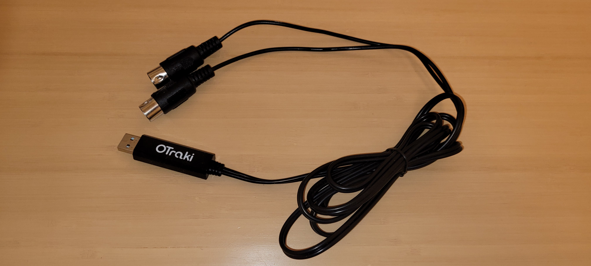

# gimme_notes_ya
Test-program for accessing MIDI devices and perform some simple things with it.

## Setup
### Hardware-setup
* **Keyboard**: YAMAHA PSR-320
  
* **USB-MIDI-adapter**: OTraki MIDI-USB cable interface (Manual: http://www.otraki.com/module/mi/umc/details.html?id=0)
  
  * Attention: Connect the IN-plug of the adapter to the OUT-jack on the keyboard and vice versa!
* **PC**: Surface Pro, Windows 10
* **PC-Keyboard**: Cherry JK-85


### Software-setup
There are many ways to configure this setup. The following is configured to use a virtual keyboard and with it set notes in the scorewriter using a virtual MIDI cable. 
* **MuseScore** https://musescore.org/: Scorewriter which can create, play back and print sheet music.
  * &rarr; Edit &rarr; Preferences &rarr; I/O &rarr; Port Audio &rarr; choose *LoopBe Internal MIDI*.
* **LoopBe1** https://www.nerds.de/en/loopbe1.html: Internal MIDI device for transferring MIDI data between computer programs.
  * &rarr; There's nothing to configure.
* **MidiEditor** http://www.midieditor.org/ (Alternatively **VMPK** [https://vmpk.sourceforge.io/]): Virtual Keyboard (and more).
  * &rarr; Edit &rarr; Settings &rarr; Midi I/O &rarr; In list *Midi output* select *LoopBe Internal MIDI 1*. 

### Install
```cmd
pip install pygame
pip install music21
pip install tk
pip install pandas
```

### Connection-schema
This schema show how the different parts of the setup are organized and connected. 


## How to use the program
This program has different modes it can operate in:
* **play**: Takes a musicxml file as input and plays its notes (and instruments) on the specified MIDI output device.
  ```cmd
  midi_test.py p --output_device_id=0 --musicxml_file=ActorPreludeSample.musicxml --bpm=80
  ```
* **show**: Received keyboard events and displays these notes in a window and plays them on the specified MIDI output device. The PC-keyboard can also be used to simulate key-strokes.
  ```cmd
  midi_test.py s --input_device_id=2 --output_device_id=0 --use_computer_keyboard=1
  ```
* **thru**: Takes the input from a MIDI device and passes it to another one. When testing this using a keyboard, one cannot hear the effect as the keyboard itself plays the sound at the same time as the notes from this test program. But it for testing purposes a sleep of e.g. 0.5s gets executed in MidiTestThru's cb_event, the keyboard will play each note twice, one shortly after another.
  ```cmd
  midi_test.py t --input_device_id=2 --output_device_id=5
  ```

### Examples:
* Use the keyboard to write notes in MuseScore, export it as musicxml-file.
* Load musicxml-file with `midi_test` and play it on a local MIDI sound device or on the keyboard.
* Create events hitting keys on the keyboard. In the `show` mode it shows the notes, but what else could be done with it?
* Use the PC-keyboard to set notes in MuseScore or maybe later in `midi_test` itself.
* Hit keys in virtual MIDI keyboard and create events in program and e.g. play sounds on the keyboard.

## Choose input/output device
When not specifying a valid device id, the program asks the used to choose one from the list. These lists might look like this:
```
Available MIDI input devices
* [1] "LoopBe Internal MIDI" (interface: "MMSystem")
* [2] "USB MIDI Interface" (interface: "MMSystem")

Available MIDI output devices
* [0] "Microsoft MIDI Mapper" (interface: "MMSystem")
* [3] "Microsoft GS Wavetable Synth" (interface: "MMSystem")
* [4] "LoopBe Internal MIDI" (interface: "MMSystem")
* [5] "USB MIDI Interface" (interface: "MMSystem")
```

##  Known issues
* The sound created when playing musicxml-files sounds not correct. The reason for that is unknown.
* When playing musicxml-files, these files are just parsed in a very simple way: it just reads the notes from the parts, creates on- and off-commands, sorts them and finally play them on the specified MIDI output-device. Probably this needs to be done in a more sophisticated way. Basis for that might be the [musicxml-specification](https://www.w3.org/2021/06/musicxml40/).
* When playing musicxml-files, for now the instrument for a note's channel is set each time just before the note is played. The reason for that is that it's unknown if there's a way to read the assignment between instrument and channel in a part in advance and set it only once.
* On hitting Ctrl+C the program does not exit - this combination needs to get hit twice.

## ToDo
* Show music notes or even create a musical notation. But not sure, if it makes sense, as there is enough software out there doing this. This is still in the testing phase. Some valuable information on how to create note-graphics using MuseScore:
  * Add the MuseScore bin-folder to the system's `PATH` environment variable.
  * Set notes using a keyboard or with Python code.
  * Manually change the page layout in MuseScore (width=2000, that's the max. value) and then export as PNG (limited to 10 lines?). Then crop this PNG. 

## References
* Accessing MIDI using pygame: https://www.pygame.org/docs/ref/midi.html
* Mapping between instrument numbers and instruments: https://fmslogo.sourceforge.io/manual/midi-instrument.html
* Drawing notes with Python:
  * https://www.audiolabs-erlangen.de/resources/MIR/FMP/C1/C1S2_MusicXML.html
  * https://www.audiolabs-erlangen.de/resources/MIR/FMP/C1/C1S2_SymbolicRendering.html
* Note Entry with Virtual Piano Keyboard: https://musescore.org/en/node/8000

## Copyright of musicxml-files
* Easy Piano
  * Interstellar.musicxml
* Claudia Ehrenpreis et al. (1 2 3 Kla-Vier)
  * Die Super-Riesen-Schlingel-Schlange.musicxml
* https://www.musicxml.com/music-in-musicxml/example-set/
  * Saltarello.musicxml
  * ActorPreludeSample.musicxml
